# 🗄️ 38 — PostgreSQL Database Design

> *Scalable to 10 Million Users*

This document covers the full backend/cloud database architecture for Marketland+, complementing the Unity-side technical design in [Technical Systems](systems/36-technical-systems.md). Every table maps directly to a game system described elsewhere in this GDD.

← [Technical Systems](systems/36-technical-systems.md) | [Back to README](../README.md)

---

## 🐘 Why PostgreSQL

Marketland+ requires a relational database that can handle **highly consistent wallet transactions**, **flexible per-player game state**, and **time-series analytics** — all at mobile-game scale.

| Requirement | PostgreSQL Feature |
|-------------|-------------------|
| ACID wallet transactions (no duplicate rewards) | Full ACID with row-level locking |
| Flexible store/farm layout storage | JSONB columns with GIN indexes |
| Player data isolation for multi-tenant API | Row-Level Security (RLS) |
| 10M player tables without full-table scans | Table partitioning + BRIN indexes |
| Time-series event analytics (crop harvests, purchases) | TimescaleDB extension |
| Proven game-backend scale | Used by Discord, Twitch, and major live-service backends |

### Recommended Stack

- **PostgreSQL 16+** — primary database
- **PgBouncer** — connection pooling (transaction mode, up to 10,000 logical connections)
- **Redis 7+** — hot-state cache layer (wallets, active timers, leaderboards)
- **TimescaleDB** — time-series extension for `player_events` analytics
- **pg_cron** — scheduled jobs (partition creation, snapshot pruning, job archiving)
- **Flyway** — versioned schema migrations

---

## 📐 Scaling Philosophy

### Design Principles for 10 Million Users

Marketland+'s write patterns are predictable and game-specific. At 10M active players:

- **Crop timers** fire every 5–30 min per player → up to **~2M timer completion events/hour**
- **Processing jobs** complete every 10–60 min → up to **~600K job events/hour**
- **Store purchases** occur ~5 times per session → up to **~500K purchase writes/hour** at peak
- **Wallet updates** accompany every meaningful action → highest-frequency write table

These patterns demand a layered approach:

#### Horizontal Read Scaling
Streaming read replicas serve all read traffic. A single **primary** handles all writes; **N read replicas** handle reads. The game client reads from replicas for non-critical data (leaderboards, market listings) and always writes to primary.

#### Table Partitioning
All high-volume append-only tables (`player_events`, `save_snapshots`, `processing_jobs`) are partitioned:
- `player_events` → **range-partitioned by month** (auto-created via pg_cron)
- Large player-scoped tables → **hash-partitioned by `player_id`** for even distribution

#### Connection Pooling
PgBouncer in **transaction mode** multiplexes thousands of short API requests over a small pool of real database connections. Recommended pool size: 200 real PG connections shared across 10,000 logical client connections.

#### Caching Layer (Redis)
Hot player state never hits PostgreSQL directly on read:
- `player:{uuid}:wallet` — TTL 30 s, write-through on every wallet mutation
- `player:{uuid}:timers` — sorted set keyed by expiry timestamp
- Leaderboards — Redis sorted sets refreshed every 5 min from a read replica

#### Write Path
```
API Server → validate → Redis write-through → PostgreSQL primary (async write-behind for non-critical; sync for wallet)
```
Wallet mutations are **synchronous** to PostgreSQL (ACID). Timer-state writes use **async write-behind** with a Redis journal to reduce primary load.

#### Sharding Strategy
Logical sharding by `player_id % N_shards` is prepared from day one via the `shard_key` generated column on the `players` table. This allows migration to **Citus** (distributed PostgreSQL) without an application-level rewrite.

#### JSONB for Flexible Data
- Hot scalar fields (`level`, `coins`, `xp`) → **proper columns** with CHECK constraints and indexes
- Rarely-queried nested config (store layout tile metadata, settings) → **JSONB columns**
- JSONB indexed with **GIN** for containment queries; BRIN on timestamps for range scans

### Scale Milestones

| Players | Infrastructure |
|---------|---------------|
| 0 – 100 K | 1 primary, 1 replica, single PgBouncer, Redis single node |
| 100 K – 1 M | 1 primary, 2 replicas, Redis cluster, CDN for static assets |
| 1 M – 5 M | Logical replication shards × 4, TimescaleDB for analytics, PgBouncer pool per shard |
| 5 M – 10 M | Citus extension (distributed PG), 8 shards, multi-region read replicas, Redis Cluster × 3 |

---

## 🏗️ Schema Design — Core Tables

All tables use `UUID` primary keys for `players` and `BIGSERIAL` for child rows. Foreign keys reference `players(player_id) ON DELETE CASCADE` so removing a player cleans up all data automatically.

### players

```sql
CREATE TABLE players (
  player_id        UUID PRIMARY KEY DEFAULT gen_random_uuid(),
  username         VARCHAR(32) NOT NULL UNIQUE,
  email            VARCHAR(255) UNIQUE,
  created_at       TIMESTAMPTZ NOT NULL DEFAULT now(),
  last_login_at    TIMESTAMPTZ,
  level            SMALLINT NOT NULL DEFAULT 1 CHECK (level BETWEEN 1 AND 200),
  xp               INTEGER NOT NULL DEFAULT 0,
  -- Wallet (mirrors WalletData in Unity save)
  coins            BIGINT NOT NULL DEFAULT 0 CHECK (coins >= 0),
  cash             INTEGER NOT NULL DEFAULT 0 CHECK (cash >= 0),
  farm_tokens      INTEGER NOT NULL DEFAULT 0 CHECK (farm_tokens >= 0),
  luxury_points    INTEGER NOT NULL DEFAULT 0 CHECK (luxury_points >= 0),
  -- Prestige
  prestige_level   SMALLINT NOT NULL DEFAULT 0,
  -- Meta
  platform         VARCHAR(16),           -- 'ios' | 'android'
  device_id        VARCHAR(128),
  is_banned        BOOLEAN NOT NULL DEFAULT FALSE,
  settings         JSONB NOT NULL DEFAULT '{}',
  -- Shard routing hint (0-7) derived from first byte of UUID
  shard_key        SMALLINT GENERATED ALWAYS AS (
                     ('x' || substr(player_id::text, 1, 2))::bit(8)::int % 8
                   ) STORED
);

CREATE INDEX idx_players_level      ON players(level);
CREATE INDEX idx_players_last_login ON players(last_login_at);
```

> **Wallet columns are kept as scalar integers** (not JSONB) so they can be updated with atomic `UPDATE players SET coins = coins - $1 WHERE player_id = $2 AND coins >= $1` patterns, preventing negative balances without application-level locking.

---

### farm_state

One row per player. Mirrors `FarmData` from the Unity save system.

```sql
CREATE TABLE farm_state (
  player_id        UUID PRIMARY KEY REFERENCES players(player_id) ON DELETE CASCADE,
  unlocked_zones   SMALLINT[] NOT NULL DEFAULT '{0}',  -- zone indexes 0–9
  active_season    VARCHAR(16) NOT NULL DEFAULT 'spring',  -- 'spring'|'summer'|'autumn'|'winter'
  active_weather   VARCHAR(16),          -- 'rain'|'storm'|'heatwave'|'fog'|'rainbow'|NULL
  weather_ends_at  TIMESTAMPTZ,
  layout_snapshot  JSONB NOT NULL DEFAULT '{}',   -- lightweight tile metadata for quick load
  updated_at       TIMESTAMPTZ NOT NULL DEFAULT now()
);
```

---

### crop_plots

One row per planted plot. Supports the 19 crops and 4 plot sizes (1×1 through 4×4) documented in [Crop System](farm/07-crop-system.md).

```sql
CREATE TABLE crop_plots (
  plot_id          BIGSERIAL PRIMARY KEY,
  player_id        UUID NOT NULL REFERENCES players(player_id) ON DELETE CASCADE,
  zone_index       SMALLINT NOT NULL,         -- 0–9 matching farm zones
  grid_x           SMALLINT NOT NULL,
  grid_y           SMALLINT NOT NULL,
  plot_size        SMALLINT NOT NULL DEFAULT 1 CHECK (plot_size BETWEEN 1 AND 4),
                                              -- 1=1x1, 2=2x2, 3=3x3, 4=4x4
  crop_type        VARCHAR(32),               -- NULL = empty plot
                                              -- e.g. 'wheat','tomato','exotic_orchid'
  planted_at       TIMESTAMPTZ,
  ready_at         TIMESTAMPTZ,               -- server-side completion timestamp
  wilts_at         TIMESTAMPTZ,               -- NULL if crop cannot wilt
  fertilised       BOOLEAN NOT NULL DEFAULT FALSE,
  mastery_harvests INTEGER NOT NULL DEFAULT 0,
  UNIQUE (player_id, zone_index, grid_x, grid_y)
);

CREATE INDEX idx_crop_plots_player ON crop_plots(player_id);
CREATE INDEX idx_crop_plots_ready  ON crop_plots(ready_at)
  WHERE crop_type IS NOT NULL;               -- partial index: only planted plots
```

> At 10M players with an average of 20 active plots each, this table holds ~200M rows. The partial index on `ready_at` keeps timer-completion queries fast — the server sweeps `WHERE ready_at <= now() + interval '5 minutes'` per player to push notifications.

---

### animal_pens

Supports the 9 animal types and 3 upgrade tiers documented in [Animal Husbandry](farm/08-animal-husbandry.md).

```sql
CREATE TABLE animal_pens (
  pen_id              BIGSERIAL PRIMARY KEY,
  player_id           UUID NOT NULL REFERENCES players(player_id) ON DELETE CASCADE,
  zone_index          SMALLINT NOT NULL,
  animal_type         VARCHAR(32) NOT NULL,   -- 'chicken'|'cow'|'sheep'|'pig'|'bee'|
                                              -- 'goat'|'duck'|'rabbit'|'deer'
  capacity            SMALLINT NOT NULL DEFAULT 2,
  current_count       SMALLINT NOT NULL DEFAULT 0,
  upgrade_tier        SMALLINT NOT NULL DEFAULT 1 CHECK (upgrade_tier BETWEEN 1 AND 3),
  happiness           SMALLINT NOT NULL DEFAULT 100 CHECK (happiness BETWEEN 0 AND 100),
  next_collect_at     TIMESTAMPTZ,
  mastery_collections INTEGER NOT NULL DEFAULT 0
);

CREATE INDEX idx_animal_pens_player ON animal_pens(player_id);
```

---

### processing_jobs

Tracks active and completed jobs for all 16 processing buildings documented in [Processing Buildings](farm/09-processing-buildings.md).

```sql
CREATE TABLE processing_jobs (
  job_id          BIGSERIAL PRIMARY KEY,
  player_id       UUID NOT NULL REFERENCES players(player_id) ON DELETE CASCADE,
  building_type   VARCHAR(32) NOT NULL,   -- 'barn'|'dairy'|'bakery'|'juicer'|
                                          -- 'cannery'|'gourmet_kitchen' etc.
  recipe          VARCHAR(64) NOT NULL,   -- e.g. 'wheat_flour', 'strawberry_jam'
  queued_at       TIMESTAMPTZ NOT NULL DEFAULT now(),
  starts_at       TIMESTAMPTZ NOT NULL,
  finishes_at     TIMESTAMPTZ NOT NULL,
  is_complete     BOOLEAN NOT NULL DEFAULT FALSE,
  output_qty      SMALLINT NOT NULL,
  xp_reward       SMALLINT NOT NULL
);

CREATE INDEX idx_jobs_player_active ON processing_jobs(player_id, finishes_at)
  WHERE NOT is_complete;
CREATE INDEX idx_jobs_finishes      ON processing_jobs(finishes_at)
  WHERE NOT is_complete;
```

---

### store_state

One row per player. Mirrors `StoreData` from the Unity save system.

```sql
CREATE TABLE store_state (
  player_id        UUID PRIMARY KEY REFERENCES players(player_id) ON DELETE CASCADE,
  unlocked_zones   SMALLINT[] NOT NULL DEFAULT '{1}',  -- zone indexes 1–8
  active_campaign  VARCHAR(32),           -- 'flash_sale'|'double_points'|
                                          -- 'fresh_market'|'luxury_event'|'vip_night'|NULL
  campaign_ends_at TIMESTAMPTZ,
  floor_type       VARCHAR(32) NOT NULL DEFAULT 'basic_tile',
  wall_type        VARCHAR(32) NOT NULL DEFAULT 'basic_wall',
  layout_snapshot  JSONB NOT NULL DEFAULT '{}',   -- display placement metadata
  updated_at       TIMESTAMPTZ NOT NULL DEFAULT now()
);
```

---

### displays

One row per placed display. Supports 70+ display types across 8 categories documented in [Displays — All Categories](store/17-displays-all.md).

```sql
CREATE TABLE displays (
  display_id      BIGSERIAL PRIMARY KEY,
  player_id       UUID NOT NULL REFERENCES players(player_id) ON DELETE CASCADE,
  display_type    VARCHAR(64) NOT NULL,   -- e.g. 'bread_shelf', 'premium_cheese_case'
  zone_index      SMALLINT NOT NULL,
  grid_x          SMALLINT NOT NULL,
  grid_y          SMALLINT NOT NULL,
  supply_mode     VARCHAR(16) NOT NULL DEFAULT 'supplier',
                                          -- 'farm'|'supplier'|'hybrid'
  stock_qty       SMALLINT NOT NULL DEFAULT 0,
  max_capacity    SMALLINT NOT NULL,
  upgrade_tier    SMALLINT NOT NULL DEFAULT 1,
  mastery_stars   SMALLINT NOT NULL DEFAULT 0 CHECK (mastery_stars BETWEEN 0 AND 3),
  UNIQUE (player_id, zone_index, grid_x, grid_y)
);

CREATE INDEX idx_displays_player ON displays(player_id);
```

---

### inventory

Unified barn + stockroom inventory. The `location` discriminator maps to the `ItemOrigin` flag in the Unity `ItemData` struct.

```sql
CREATE TABLE inventory (
  inventory_id    BIGSERIAL PRIMARY KEY,
  player_id       UUID NOT NULL REFERENCES players(player_id) ON DELETE CASCADE,
  location        VARCHAR(16) NOT NULL CHECK (location IN ('barn', 'stockroom')),
  item_type       VARCHAR(64) NOT NULL,   -- e.g. 'wheat', 'whole_milk', 'strawberry_jam'
  quantity        INTEGER NOT NULL DEFAULT 0 CHECK (quantity >= 0),
  is_fresh        BOOLEAN NOT NULL DEFAULT FALSE,  -- 🌿 Fresh tag from farm origin
  origin          VARCHAR(16) NOT NULL DEFAULT 'supplier'
                    CHECK (origin IN ('farm', 'supplier')),
  harvested_at    TIMESTAMPTZ,
  UNIQUE (player_id, location, item_type, is_fresh)
);

CREATE INDEX idx_inventory_player ON inventory(player_id, location);
```

---

### quests

Tracks all three quest types — daily, story, and farm — documented in [Quest System](systems/27-quest-system.md).

```sql
CREATE TABLE quests (
  quest_id        BIGSERIAL PRIMARY KEY,
  player_id       UUID NOT NULL REFERENCES players(player_id) ON DELETE CASCADE,
  quest_type      VARCHAR(16) NOT NULL CHECK (quest_type IN ('daily', 'story', 'farm')),
  quest_key       VARCHAR(64) NOT NULL,   -- e.g. 'daily_harvest_wheat_10'
  progress        INTEGER NOT NULL DEFAULT 0,
  target          INTEGER NOT NULL,
  is_complete     BOOLEAN NOT NULL DEFAULT FALSE,
  completed_at    TIMESTAMPTZ,
  expires_at      TIMESTAMPTZ,            -- non-NULL for daily quests (midnight reset)
  xp_reward       SMALLINT NOT NULL,
  UNIQUE (player_id, quest_key, expires_at)
);

CREATE INDEX idx_quests_player_active ON quests(player_id)
  WHERE NOT is_complete;
```

---

### player_cards

Tracks all 4 card types — Shopper, Quick Delivery, Product, and Harvest — documented in [Card System](systems/26-card-system.md).

```sql
CREATE TABLE player_cards (
  card_id         BIGSERIAL PRIMARY KEY,
  player_id       UUID NOT NULL REFERENCES players(player_id) ON DELETE CASCADE,
  card_type       VARCHAR(32) NOT NULL
                    CHECK (card_type IN ('shopper', 'quick_delivery', 'product', 'harvest')),
  card_key        VARCHAR(64) NOT NULL,   -- e.g. 'shopper_bulk_buyer_rare'
  acquired_at     TIMESTAMPTZ NOT NULL DEFAULT now(),
  used_at         TIMESTAMPTZ,
  is_active       BOOLEAN NOT NULL DEFAULT FALSE
);

CREATE INDEX idx_cards_player ON player_cards(player_id, card_type);
```

---

### achievements

Tracks progress against all achievements documented in [Achievements](systems/33-achievements.md).

```sql
CREATE TABLE achievements (
  achievement_id  BIGSERIAL PRIMARY KEY,
  player_id       UUID NOT NULL REFERENCES players(player_id) ON DELETE CASCADE,
  achievement_key VARCHAR(64) NOT NULL,   -- e.g. 'harvest_1000_wheat'
  progress        INTEGER NOT NULL DEFAULT 0,
  is_unlocked     BOOLEAN NOT NULL DEFAULT FALSE,
  unlocked_at     TIMESTAMPTZ,
  UNIQUE (player_id, achievement_key)
);
```

---

### mastery_records

Tracks 3-star mastery for crops, animals, processing buildings, and store displays as described in [Farm Mastery](farm/13-farm-mastery.md) and [Mastery Stars](systems/31-mastery-stars.md).

```sql
CREATE TABLE mastery_records (
  mastery_id      BIGSERIAL PRIMARY KEY,
  player_id       UUID NOT NULL REFERENCES players(player_id) ON DELETE CASCADE,
  subject_type    VARCHAR(16) NOT NULL
                    CHECK (subject_type IN ('crop', 'animal', 'building', 'store_display')),
  subject_key     VARCHAR(64) NOT NULL,   -- e.g. 'wheat', 'chicken', 'bakery'
  star_level      SMALLINT NOT NULL DEFAULT 0 CHECK (star_level BETWEEN 0 AND 3),
  action_count    INTEGER NOT NULL DEFAULT 0,
  UNIQUE (player_id, subject_type, subject_key)
);
```

---

### collection_progress

Tracks the 8 collection sets documented in [Collections](systems/28-collections.md).

```sql
CREATE TABLE collection_progress (
  collection_id   BIGSERIAL PRIMARY KEY,
  player_id       UUID NOT NULL REFERENCES players(player_id) ON DELETE CASCADE,
  collection_key  VARCHAR(64) NOT NULL,   -- e.g. 'harvest_bounty', 'luxury_pantry'
  items_collected JSONB NOT NULL DEFAULT '[]',  -- array of collected item keys
  is_complete     BOOLEAN NOT NULL DEFAULT FALSE,
  completed_at    TIMESTAMPTZ,
  UNIQUE (player_id, collection_key)
);
```

---

### shipments

Tracks external supplier orders documented in [Suppliers & Shipments](systems/23-suppliers-shipments.md).

```sql
CREATE TABLE shipments (
  shipment_id     BIGSERIAL PRIMARY KEY,
  player_id       UUID NOT NULL REFERENCES players(player_id) ON DELETE CASCADE,
  supplier_key    VARCHAR(64) NOT NULL,   -- e.g. 'regional_dairy', 'fresh_imports'
  items           JSONB NOT NULL,         -- [{item_type, qty, cost_coins}]
  ordered_at      TIMESTAMPTZ NOT NULL DEFAULT now(),
  arrives_at      TIMESTAMPTZ NOT NULL,
  is_received     BOOLEAN NOT NULL DEFAULT FALSE
);

CREATE INDEX idx_shipments_arrives ON shipments(arrives_at)
  WHERE NOT is_received;
```

---

### supply_lane_queue

Tracks in-transit farm-to-store transfers via the Supply Lane documented in [Supply Chain](systems/22-supply-chain.md).

```sql
CREATE TABLE supply_lane_queue (
  lane_id         BIGSERIAL PRIMARY KEY,
  player_id       UUID NOT NULL REFERENCES players(player_id) ON DELETE CASCADE,
  item_type       VARCHAR(64) NOT NULL,
  quantity        SMALLINT NOT NULL,
  is_fresh        BOOLEAN NOT NULL DEFAULT TRUE,   -- always TRUE for farm-origin transfers
  dispatched_at   TIMESTAMPTZ NOT NULL DEFAULT now(),
  arrives_at      TIMESTAMPTZ NOT NULL,
  is_delivered    BOOLEAN NOT NULL DEFAULT FALSE
);

CREATE INDEX idx_supply_lane_arrives ON supply_lane_queue(arrives_at)
  WHERE NOT is_delivered;
```

---

### social_neighbours

Tracks the neighbour/friend graph for social gifting documented across the social systems.

```sql
CREATE TABLE social_neighbours (
  id              BIGSERIAL PRIMARY KEY,
  player_id       UUID NOT NULL REFERENCES players(player_id) ON DELETE CASCADE,
  neighbour_id    UUID NOT NULL REFERENCES players(player_id) ON DELETE CASCADE,
  added_at        TIMESTAMPTZ NOT NULL DEFAULT now(),
  last_gift_sent  TIMESTAMPTZ,
  UNIQUE (player_id, neighbour_id),
  CHECK (player_id <> neighbour_id)   -- prevent self-friendship
);

CREATE INDEX idx_neighbours_player    ON social_neighbours(player_id);
CREATE INDEX idx_neighbours_neighbour ON social_neighbours(neighbour_id);
```

---

### farm_market_listings

Tracks player-to-player farm market stand listings.

```sql
CREATE TABLE farm_market_listings (
  listing_id      BIGSERIAL PRIMARY KEY,
  seller_id       UUID NOT NULL REFERENCES players(player_id) ON DELETE CASCADE,
  item_type       VARCHAR(64) NOT NULL,
  quantity        SMALLINT NOT NULL CHECK (quantity > 0),
  price_coins     INTEGER NOT NULL CHECK (price_coins > 0),
  listed_at       TIMESTAMPTZ NOT NULL DEFAULT now(),
  expires_at      TIMESTAMPTZ NOT NULL,
  is_sold         BOOLEAN NOT NULL DEFAULT FALSE
);

-- Compound partial index: only unsold listings, sorted by cheapest first per item
CREATE INDEX idx_market_active ON farm_market_listings(item_type, price_coins)
  WHERE NOT is_sold;
```

---

### player_events (time-series, partitioned by month)

Append-only audit/analytics table for every meaningful player action. At 10M players with ~50 events/day each, this generates **~500M rows/day** — managed entirely through monthly range partitions and TimescaleDB compression.

```sql
CREATE TABLE player_events (
  event_id        BIGSERIAL,
  player_id       UUID NOT NULL,
  event_type      VARCHAR(64) NOT NULL,   -- 'crop_harvested'|'purchase'|'quest_complete' etc.
  event_data      JSONB,                  -- flexible payload per event type
  occurred_at     TIMESTAMPTZ NOT NULL DEFAULT now()
) PARTITION BY RANGE (occurred_at);

-- Initial monthly partition (pg_cron creates future partitions automatically)
CREATE TABLE player_events_2026_03 PARTITION OF player_events
  FOR VALUES FROM ('2026-03-01') TO ('2026-04-01');

CREATE INDEX idx_events_player_time ON player_events(player_id, occurred_at DESC);
CREATE INDEX idx_events_type_time   ON player_events(event_type, occurred_at DESC);
```

---

### save_snapshots

Cloud save snapshots. A trigger enforces the **last-5-per-player** retention policy described in the [Technical Systems](systems/36-technical-systems.md) save section.

```sql
CREATE TABLE save_snapshots (
  snapshot_id     BIGSERIAL PRIMARY KEY,
  player_id       UUID NOT NULL REFERENCES players(player_id) ON DELETE CASCADE,
  version         VARCHAR(16) NOT NULL,          -- Unity client version e.g. '3.0.1'
  snapshot_data   JSONB NOT NULL,                -- full SaveData JSON blob
  checksum        VARCHAR(64) NOT NULL,          -- SHA-256 of snapshot_data
  created_at      TIMESTAMPTZ NOT NULL DEFAULT now()
);

CREATE INDEX idx_snapshots_player ON save_snapshots(player_id, created_at DESC);
```

#### Retention Trigger (keep last 5 per player)

```sql
CREATE OR REPLACE FUNCTION prune_old_snapshots()
RETURNS TRIGGER LANGUAGE plpgsql AS $$
BEGIN
  DELETE FROM save_snapshots
  WHERE player_id = NEW.player_id
    AND snapshot_id NOT IN (
      SELECT snapshot_id
      FROM save_snapshots
      WHERE player_id = NEW.player_id
      ORDER BY created_at DESC
      LIMIT 5
    );
  RETURN NEW;
END;
$$;

CREATE TRIGGER trg_prune_snapshots
  AFTER INSERT ON save_snapshots
  FOR EACH ROW EXECUTE FUNCTION prune_old_snapshots();
```

---

## 🔗 Relationships Diagram

```mermaid
erDiagram
    players ||--|| farm_state : "has"
    players ||--|| store_state : "has"
    players ||--o{ crop_plots : "owns"
    players ||--o{ animal_pens : "owns"
    players ||--o{ processing_jobs : "queues"
    players ||--o{ displays : "places"
    players ||--o{ inventory : "holds"
    players ||--o{ quests : "tracks"
    players ||--o{ player_cards : "collects"
    players ||--o{ achievements : "earns"
    players ||--o{ mastery_records : "builds"
    players ||--o{ collection_progress : "completes"
    players ||--o{ shipments : "orders"
    players ||--o{ supply_lane_queue : "transfers"
    players ||--o{ social_neighbours : "friends"
    players ||--o{ farm_market_listings : "lists"
    players ||--o{ player_events : "generates"
    players ||--o{ save_snapshots : "saves"
```



---

## 🔍 Common Query Patterns

### 1 — Load Player Dashboard

Fetches everything needed for the initial game load screen in a single round-trip.

```sql
SELECT
  p.player_id, p.username, p.level, p.xp,
  p.coins, p.cash, p.farm_tokens, p.luxury_points,
  p.prestige_level, p.settings,
  fs.unlocked_zones  AS farm_zones,
  fs.active_season,
  fs.active_weather,
  fs.weather_ends_at,
  ss.unlocked_zones  AS store_zones,
  ss.active_campaign,
  ss.campaign_ends_at,
  ss.floor_type,
  ss.wall_type
FROM   players    p
JOIN   farm_state fs USING (player_id)
JOIN   store_state ss USING (player_id)
WHERE  p.player_id = $1;
```

The hot-path result is cached in Redis at `player:{uuid}:dashboard` with TTL 30 s.

---

### 2 — Get Crop Timers Due Soon

Used by the server-side notification job and the Unity client to refresh the timer HUD.

```sql
SELECT
  plot_id, zone_index, grid_x, grid_y, crop_type,
  ready_at, wilts_at, fertilised
FROM   crop_plots
WHERE  player_id = $1
  AND  crop_type IS NOT NULL
  AND  ready_at  <= now() + INTERVAL '5 minutes'
ORDER BY ready_at ASC;
```

Hits the partial index `idx_crop_plots_ready` (only rows with `crop_type IS NOT NULL`).

---

### 3 — Check Completed Processing Jobs

Polled by the API when a player opens the farm view; also runs server-side on a 1-minute cron.

```sql
SELECT
  job_id, building_type, recipe, finishes_at, output_qty, xp_reward
FROM   processing_jobs
WHERE  player_id  = $1
  AND  finishes_at <= now()
  AND  NOT is_complete
ORDER BY finishes_at ASC;
```

Hits the partial index `idx_jobs_player_active`.

---

### 4 — Get Active Daily Quests

Returns current day's uncompleted daily quests for the Quest panel.

```sql
SELECT
  quest_id, quest_key, progress, target,
  expires_at, xp_reward
FROM   quests
WHERE  player_id  = $1
  AND  quest_type = 'daily'
  AND  expires_at  > now()
  AND  NOT is_complete
ORDER BY xp_reward DESC;
```

---

### 5 — Global Leaderboard Top 100 by Level

**Never runs against PostgreSQL on a hot path.** The result is pre-computed into a Redis sorted set and refreshed every 5 minutes from a read replica.

```sql
-- Runs on read replica every 5 minutes, result pushed to Redis
SELECT player_id, username, level, xp, prestige_level
FROM   players
WHERE  NOT is_banned
ORDER BY level DESC, xp DESC, prestige_level DESC
LIMIT  100;
```

Redis key: `leaderboard:level:top100` — a sorted set with `level * 1e9 + xp` as the score.

---

### 6 — Farm Market Listings for an Item

Returns the cheapest unsold, unexpired listings for a given item type.

```sql
SELECT
  listing_id, seller_id, quantity, price_coins, listed_at, expires_at
FROM   farm_market_listings
WHERE  item_type   = $1
  AND  NOT is_sold
  AND  expires_at  > now()
ORDER BY price_coins ASC
LIMIT  20;
```

Hits the compound partial index `idx_market_active`.

---

## ⚡ Caching Strategy with Redis

```
Game Client ──► API Server ──► Redis (cache hit?) ──► Response
                                     │
                                  cache miss
                                     │
                                     ▼
                            PostgreSQL replica
                                     │
                             fill Redis cache
                                     │
                                     ▼
                                  Response
```

| Cache Key Pattern | Structure | TTL | Write Policy |
|-------------------|-----------|-----|-------------|
| `player:{uuid}:wallet` | Hash — coins/cash/tokens/lp | 30 s | Write-through (sync) |
| `player:{uuid}:level` | String | 60 s | Write-through |
| `player:{uuid}:timers` | Sorted set (score = UNIX expiry) | 5 min | Write-through on plant/start |
| `player:{uuid}:dashboard` | JSON string | 30 s | Write-through on login |
| `leaderboard:level:top100` | Sorted set | 5 min | Async refresh from replica |
| `market:{item_type}:listings` | JSON string | 60 s | Invalidate on new listing/sale |
| `session:{token}` | Hash — player_id/platform/exp | Session TTL | Write on auth, delete on logout |

### Redis Write-Through Pattern for Wallet

```
POST /v1/wallet/spend
  → Acquire Redis lock:  SET lock:wallet:{uuid} 1 NX EX 5
  → Read current wallet: HGETALL player:{uuid}:wallet
  → Validate balance
  → BEGIN TRANSACTION (PostgreSQL)
      UPDATE players SET coins = coins - $amount WHERE player_id = $uuid AND coins >= $amount
      INSERT INTO player_events (player_id, event_type, event_data) VALUES (...)
    COMMIT
  → HSET player:{uuid}:wallet coins {new_value}
  → Release lock: DEL lock:wallet:{uuid}
```

This ensures the database is the source of truth for all wallet mutations, with Redis serving as the read cache.

---

## 🗂️ Partitioning & Maintenance

### player_events — Monthly Range Partitions

```sql
-- pg_cron job: runs on the 25th of each month to pre-create next month's partition
SELECT cron.schedule(
  'create_events_partition',
  '0 0 25 * *',
  $$
    DO $$
    DECLARE
      next_month DATE := date_trunc('month', now() + INTERVAL '1 month');
      tbl_name   TEXT := 'player_events_' || to_char(next_month, 'YYYY_MM');
    BEGIN
      EXECUTE format(
        'CREATE TABLE IF NOT EXISTS %I PARTITION OF player_events
         FOR VALUES FROM (%L) TO (%L)',
        tbl_name,
        next_month,
        next_month + INTERVAL '1 month'
      );
    END
    $$
  $$
);
```

Partitions older than **6 months** are detached and archived to cold storage (e.g., AWS S3 via `pg_dump --table`) then dropped:

```sql
-- Detach and archive: run manually or via pg_cron after cold export
ALTER TABLE player_events DETACH PARTITION player_events_2025_09;
-- After S3 backup confirmed:
DROP TABLE player_events_2025_09;
```

### processing_jobs — 30-Day Archive

```sql
-- pg_cron: archive completed jobs older than 30 days
INSERT INTO processing_jobs_archive
  SELECT * FROM processing_jobs
  WHERE  is_complete = TRUE
    AND  finishes_at < now() - INTERVAL '30 days';

DELETE FROM processing_jobs
  WHERE is_complete = TRUE
    AND finishes_at < now() - INTERVAL '30 days';
```

### VACUUM Strategy

High-write tables accumulate dead tuples quickly and need aggressive autovacuum settings:

```sql
ALTER TABLE crop_plots SET (
  autovacuum_vacuum_scale_factor  = 0.01,  -- vacuum after 1% dead tuples
  autovacuum_analyze_scale_factor = 0.005
);

ALTER TABLE processing_jobs SET (
  autovacuum_vacuum_scale_factor  = 0.01,
  autovacuum_analyze_scale_factor = 0.005
);

ALTER TABLE inventory SET (
  autovacuum_vacuum_scale_factor  = 0.02,
  autovacuum_analyze_scale_factor = 0.01
);
```

### Index Maintenance

```sql
-- Monthly: rebuild large indexes concurrently (zero downtime)
REINDEX INDEX CONCURRENTLY idx_crop_plots_ready;
REINDEX INDEX CONCURRENTLY idx_jobs_player_active;
REINDEX INDEX CONCURRENTLY idx_market_active;
```

---

## 🔒 Row-Level Security (RLS)

RLS ensures that a compromised API server instance can only read and write the authenticated player's own data. The `player_id` claim is extracted from the JWT and set as a session variable before every query.

```sql
-- Set at the start of every API request:
SET LOCAL app.current_player_id = '<player_uuid_from_jwt>';
```

Apply to every player-scoped table:

```sql
-- crop_plots
ALTER TABLE crop_plots ENABLE ROW LEVEL SECURITY;
CREATE POLICY crop_plots_isolation ON crop_plots
  USING (player_id = current_setting('app.current_player_id')::uuid);

-- animal_pens
ALTER TABLE animal_pens ENABLE ROW LEVEL SECURITY;
CREATE POLICY animal_pens_isolation ON animal_pens
  USING (player_id = current_setting('app.current_player_id')::uuid);

-- processing_jobs
ALTER TABLE processing_jobs ENABLE ROW LEVEL SECURITY;
CREATE POLICY processing_jobs_isolation ON processing_jobs
  USING (player_id = current_setting('app.current_player_id')::uuid);

-- displays
ALTER TABLE displays ENABLE ROW LEVEL SECURITY;
CREATE POLICY displays_isolation ON displays
  USING (player_id = current_setting('app.current_player_id')::uuid);

-- inventory
ALTER TABLE inventory ENABLE ROW LEVEL SECURITY;
CREATE POLICY inventory_isolation ON inventory
  USING (player_id = current_setting('app.current_player_id')::uuid);

-- quests
ALTER TABLE quests ENABLE ROW LEVEL SECURITY;
CREATE POLICY quests_isolation ON quests
  USING (player_id = current_setting('app.current_player_id')::uuid);

-- player_cards
ALTER TABLE player_cards ENABLE ROW LEVEL SECURITY;
CREATE POLICY player_cards_isolation ON player_cards
  USING (player_id = current_setting('app.current_player_id')::uuid);

-- achievements
ALTER TABLE achievements ENABLE ROW LEVEL SECURITY;
CREATE POLICY achievements_isolation ON achievements
  USING (player_id = current_setting('app.current_player_id')::uuid);

-- mastery_records
ALTER TABLE mastery_records ENABLE ROW LEVEL SECURITY;
CREATE POLICY mastery_records_isolation ON mastery_records
  USING (player_id = current_setting('app.current_player_id')::uuid);

-- collection_progress
ALTER TABLE collection_progress ENABLE ROW LEVEL SECURITY;
CREATE POLICY collection_progress_isolation ON collection_progress
  USING (player_id = current_setting('app.current_player_id')::uuid);

-- shipments
ALTER TABLE shipments ENABLE ROW LEVEL SECURITY;
CREATE POLICY shipments_isolation ON shipments
  USING (player_id = current_setting('app.current_player_id')::uuid);

-- supply_lane_queue
ALTER TABLE supply_lane_queue ENABLE ROW LEVEL SECURITY;
CREATE POLICY supply_lane_queue_isolation ON supply_lane_queue
  USING (player_id = current_setting('app.current_player_id')::uuid);

-- save_snapshots
ALTER TABLE save_snapshots ENABLE ROW LEVEL SECURITY;
CREATE POLICY save_snapshots_isolation ON save_snapshots
  USING (player_id = current_setting('app.current_player_id')::uuid);
```

> **Admin roles** are granted `BYPASSRLS` so internal tooling and data migrations work without changing session variables. All player-facing API roles use dedicated restricted roles with RLS active.

---

## 🚀 Migration Strategy

All schema changes are managed with **Flyway** versioned migrations stored in `db/migrations/`.

### File Naming Convention

```
V38__add_postgresql_core_schema.sql
V39__add_mastery_records.sql
V40__add_supply_lane_queue.sql
```

### Zero-Downtime Approach

| Step | Action |
|------|--------|
| 1 | Add new column with a `DEFAULT` value (instantly non-blocking in PG 11+) |
| 2 | Backfill in batches: `UPDATE ... WHERE id BETWEEN $start AND $end` |
| 3 | Add `NOT NULL` constraint once backfill is complete |
| 4 | Drop old column in a separate migration after confirming no reads |

### Blue/Green Deployment

For major schema changes (e.g., adding a new table or changing a partition scheme):
1. Deploy new schema to **green** environment
2. Run migration on green with production data snapshot
3. Validate via automated integration tests
4. Switch load balancer to green; keep blue warm for 30-minute rollback window

### Example Migration File

```sql
-- V38__add_postgresql_core_schema.sql
-- Creates base tables for Marketland+ PostgreSQL backend

BEGIN;

CREATE TABLE IF NOT EXISTS players ( ... );
CREATE TABLE IF NOT EXISTS farm_state ( ... );
-- ... all tables from this document

COMMIT;
```

---

## 📊 Monitoring & Health

| Metric | Tool | Alert Threshold |
|--------|------|----------------|
| Query p99 latency | `pg_stat_statements` + Grafana | > 100 ms |
| Connection pool saturation | PgBouncer metrics (`pgbouncer.stats`) | > 80 % |
| Replication lag | `pg_stat_replication.replay_lag` | > 5 s |
| Table bloat (dead tuples) | `pgstattuple` | > 30 % dead tuples |
| Slow queries | `auto_explain` (log_min_duration = 500 ms) | > 500 ms |
| Disk usage | `node_exporter` → Grafana | > 75 % |
| Cache hit ratio | `pg_stat_bgwriter` | < 95 % |
| Active locks | `pg_locks` | Any lock wait > 1 s |

### Key pg_stat_statements Queries to Watch

```sql
-- Top 10 slowest average queries
SELECT
  round(mean_exec_time::numeric, 2) AS mean_ms,
  calls,
  query
FROM   pg_stat_statements
ORDER BY mean_exec_time DESC
LIMIT  10;
```

### PgBouncer Health Check

```sql
-- Connect to PgBouncer admin console
SHOW POOLS;   -- sv_active, sv_idle, cl_waiting
SHOW STATS;   -- avg_query_time, avg_wait_time
```

---

← [Previous — Technical Systems](systems/36-technical-systems.md) | [Back to README](../README.md)
